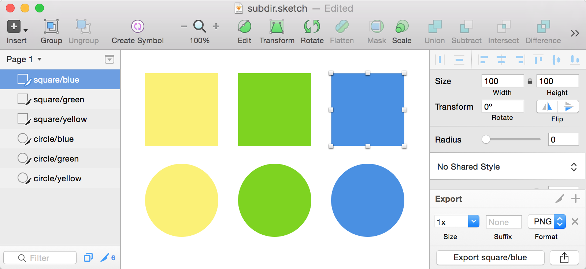

# gulp-sketch [](https://travis-ci.org/cognitom/gulp-sketch) [](https://waffle.io/cognitom/gulp-sketch)

A [SketchTool](http://bohemiancoding.com/sketch/tool/) plugin for [gulp](https://github.com/wearefractal/gulp).


## Install

If you're using Sketch.app `ver 3.5` or later, just install `gulp-sketch` via `npm`:

```bash
$ npm install gulp-sketch --save-dev
```

Are you new to Sketch.app or the user of ver < 3.5 ? See [the section below](#install-sketchtool).

## Usage

```javascript
var gulp   = require('gulp');
var sketch = require('gulp-sketch');

gulp.task('sketch', function(){
  return gulp.src('./src/sketch/*.sketch')
    .pipe(sketch({
      export: 'slices',
      formats: 'png'
    }))
    .pipe(gulp.dest('./dist/images/'));
});
```

or write it in CoffeeScript.

```coffeescript
gulp   = require 'gulp'
sketch = require 'gulp-sketch'

gulp.task 'sketch', ->
  gulp.src './src/sketch/*.sketch'
  .pipe sketch
    export: 'slices'
    formats: 'png'
  .pipe gulp.dest './dist/images/'
```


## Options

The options are the same as what's supported by `SketchTool`.

- `export`: pages,artboards,slices
- `formats`: png,jpg,pdf,eps,svg
- `scales`: 1.0,2.0
- `items`: List of artboard/slice names or ids to export. The default is to export all artboards/slices (optional).
- `bounds`:
- `saveForWeb`: Export web-ready images (optional, defaults to NO).
- `compact`: Export in compact form. Currently only relevant for SVG export. (optional, defaults to NO).
- `trimmed`: Export images trimmed. (optional, defaults to NO).

Additionally, it has `clean` option for exporting SVG.

- `clean`: Remove Sketch namespaces and metadata from SVG (optional, defaults to NO). See [clean-sketch](https://github.com/overblog/clean-sketch).

For debugging purposes, it has `verbose` option for additional output

- `verbose`: Enables verbose output and outputs stdout from `sketchtool` (optional, defaults to false)


## Layer Naming

When exporting slices, the name of layer is the key to decide the name of the file exported.

- If you have the layer named `yellow` and export it with option `{ format:'png' }`, the exported file would be `yellow.png`.
- If you have the layer named `square/yellow` and export it with same option, the file would be exported as `yellow.png` under `square/` directory.



Bohemian Coding mentioned about it in [their article](http://bohemiancoding.com/sketch/support/documentation/11-exporting/2-slices.html).

> You can give each of your slices their own name, and this is the name that will be used when you save your slice to disk.
> A neat trick is that you if you include a slash (a '/') it will create subfolders for your first. For example, if you named your slice foo/bar.png, it would first create a folder named 'foo' and then create a image named 'bar.png' in there.


## Should include or not include generated files?

Basically not. But sometimes it would be controversial. Because tools like `sketchtool` depends on the environment. Especially Windows user can't use `sketchtool`.

- All members in the team use Mac? - Force to install `sketchtool`. It's free!
- Most of members in the team use Mac? - Force to install `sketchtool`. Make `sketch`-related tasks skippable for Windows user.
- Only a designer uses Mac? - Include generated design works and make `sketch`-related tasks optional.

### How to skip a task for Windows user

Check `sketchtool` exists by [npm-which](https://github.com/timoxley/npm-which).

```javascript
var gulp   = require('gulp');
var sketch = require('gulp-sketch');
var gutil  = require('gulp-util')
var which  = require('npm-which')(__dirname);

gulp.task('sketch', function(){
  try {
    which.sync('sketchtool');
  } catch(error){
    gutil.log(error); return;
  }

  return gulp.src('./src/sketch/*.sketch')
    .pipe(sketch({
      export: 'slices',
      formats: 'png'
    }))
    .pipe(gulp.dest('./dist/images/'));
});
```

## Install SketchTool

After the version 3.5, Sketch.app has started bundling `sketchtool`. You don't have to install it manually. Only the cases below, install `sketchtool` by yourself.

### I'm a developer and not have a license of Sketch.app

Don't worry, the tool doesn't need a license. Run this command to install:

```bash
$ npm run install-sketchtool
```

### I'm a user of the older version of Sketch.app (< ver 3.5)

Download [SketchTool](http://sketchtool.bohemiancoding.com/sketchtool-latest.zip) and install it to your environment by hand.
